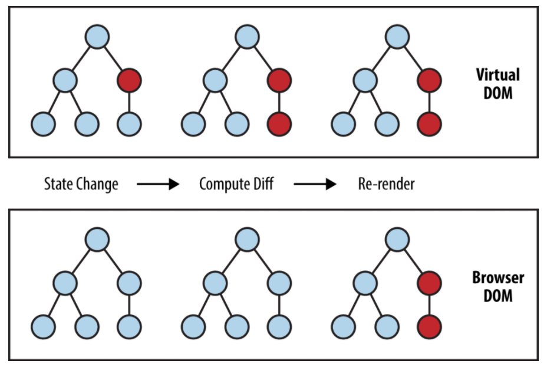
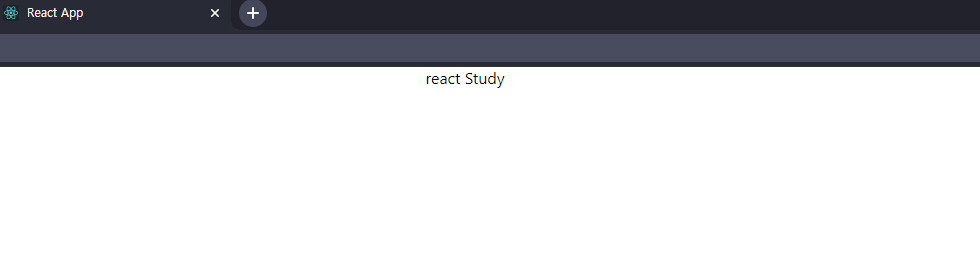
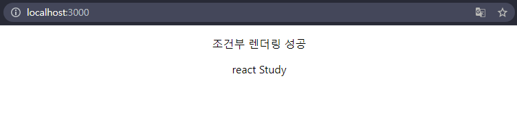

# VeloPert React Study

## 리액트란?
- 기존 JS에서는 브라우저의 DOM Selector API를 사용해서 특정 DOM을 선택후, 특정 이벤트가 발생하면 변화를 주도록 선택해야한다. 

- 인터랙션이 자주 발생하고, 이에 따라 동적으로 UI를 표현해야한다면, 이러한 규칙이 다양해질것이고 , 그러면 관리하기도 힘들어질것입니다.

 </img>
 
- 이러한 단점을 보완하고자 다양한 프레임 워크들이 개발이 되었습니다 (Angular,React,Vue) 

- React는 상태가 변경되는 Dom을 업데이트해서 기존의 상태가 전부 바뀌는것과 비교해 속도에서 차이를 보여줍니다.

- 이러한 변경점은 React의 가상돔(vitual Dom)에 대해서 알아보도록 하겠습니다.

    - 가상돔이란? : 실제 돔에 접근하여 조작하는 대신 추상화 시킨 JS객체를 사용하는것

    - 절차 : 변화 발생 -> 변화된 버전을 가상돔으로 변환 -> 가상돔 끼리 비교 -> 바뀐 부분만 적용

     </img>

## 리액트 시작하기

- 리액트를 처음부터 하나씩 세팅할수 있지만, `npx create-react-app 폴더명` 을 통해 간편하게 세팅할수 있다.

- 해당 명령어를 통해 설치를 하게되면 JSX라는 파일이 생긴다.

- JSX는 얼핏보면 HTML처럼 생겼지만 JS로 구성되어있어 HTML과는 다른 규칙을 따른다.

- index.jsx는 아래와 같은 형식을 가진다.

``` js
import React from 'react'; //react 설정
import ReactDOM from 'react-dom'; // reactDom 설정
import './index.css'; // CSS 파일 설정
import App from './App'; // 컴포넌트 설정
import reportWebVitals from './reportWebVitals'; // 리액트의 성능 측정

ReactDOM.render(
  <React.StrictMode> 
    <App />  // app.js 컴포넌트 출력
  </React.StrictMode>,
  document.getElementById('root')
);
reportWebVitals();

//reactDOM.render를 이용해 출력

// React.StrictMode 
//  1) 안전하지 않은 생명주기를 사용하는 컴포넌견 발견
//  2) 레거시 문자열 ref 사용에 대한 경고
//  3) 권장되지 않는 findDOMNode 사용에 대한 경고
//  4) 예상치 못한 부작용 검사
//  5) 레거시 context API 검사
```
- JSX의 규칙 : 태그들은 감싸져있어야 하며 닫혀있어야 한다.

## props 

- Props : properties의 줄임말

- 사용법 

```js
import React from 'react';
import tmp from './tmp';

function App() {
  return (
    <Hello name="react" />
  );
}

export default App;
```

```js
import React from 'react';

function tmp(props) {
  return <div>{props.name}</div>
}

export default tmp;
```

- 결과물

</img>

## 조건부 렌더링 

- 조건부 렌더링은 if문을 return 구문에서 사용할수 없기에 삼항 연산자를 활용하여 구현한다.

```js
import React from 'react';

function tmp(name) {
  return (
    <div>
      { name ? <b>조건부 렌더링 성공\n</b> : null }
      안녕하세요 {name}
    </div>
  );
}

Hello.defaultProps = {
  name: 'Props 전달 없음'
}

export default tmp;

```
- 결과물

</img>


## State

- 컴포넌트의 State를 설정하여 관리할수있습니다.

```js
import React from 'react';
  const [number, setnumber] = useState(0);
  const ChangeCount=(e)=>{
    setnumber(number+e)
  }
function Counter() {
  return (
    <div>
      <h1>0</h1>
      <button>+1</button>
      <button>-1</button>
    </div>
  );
}

export default Counter;
```
```js
import React, { useState } from 'react';

function InputSample() {
  const [inputs, setInputs] = useState({
    name: '',
    nickname: ''
  });

  const { name, nickname } = inputs; // 비구조화 할당을 통해 값 추출

  const onChange = (e) => {
    const { value, name } = e.target; // 우선 e.target 에서 name 과 value 를 추출
    setInputs({
      ...inputs, // 기존의 input 객체를 복사한 뒤
      [name]: value // name 키를 가진 값을 value 로 설정
    });
  };

  const onReset = () => {
    setInputs({
      name: '',
      nickname: '',
    })
  };


  return (
    <div>
      <input name="name" placeholder="이름" onChange={onChange} value={name} />
      <input name="nickname" placeholder="닉네임" onChange={onChange} value={nickname}/>
      <button onClick={onReset}>초기화</button>
      <div>
        <b>값: </b>
        {name} ({nickname})
      </div>
    </div>
  );
}

export default InputSample;
```

## useRef(js의 getElementById)

- js에서 DOM을 선택할때 getElementById나 querySelector와 같은 기능이 필요할때 사용합니다.

- 이번 강의에서는 class형 react를 사용하지 않지만 class 형태에서는 React.createRef를 사용합니다.

```js
import React, { useRef } from 'react';
const nameInput = useRef();
  const onReset = () => {
    setInputs({
      name: '',
      nickname: ''
    });
    nameInput.current.focus();
  };
```

## array Rendering

- 우리가 서버와 rest통신을 통해서 자료를 받아온다고 가정하면 User의 데이터가 배열 행태로 들어오게 될것입니다.

```js
  const cars = [
    {
      id: 1,
      car: 'bentz',
      number: '12가1234'
    },
    {
      id: 2,
      car: 'kia',
      number: '22타1014'
    },
    {
      id: 3,
      car: 'morning',
      number: '19라2038'
    }
  ];
```
- 위와 같은 데이터들이 있다고 가정하겠습니다.
- 데이터를 읽어 한줄씩 출력하기위해서는 map을 사용해야합니다. (return 구문안에서는 for문이 사용이 불가합니다)

```js
import React from 'react';
import Cars from'../dummy/cars';

function CarLayout({data}){
    return(
        <div style = {{border : "1px solid black"}} >
            <p>{data.id}</p>
            <p>{data.car}</p>
            <p>{data.number}</p>
        </div>
    )
}

function Counter() {
  return (
    <div>
        {Cars.map(dummy => {
           return <CarLayout data = {dummy}/>
        })}
    </div>
  );
}

export default Counter;
```

- 결과물 

</img>

- 결과물 자체는 문제 없이 출력 되지만 콘솔창을 들어가보면 key값을 배치해 달라는 글이 있다.

```js
  {Cars.map(dummy => {
    return <CarLayout data = {dummy} key = {dummy.id}/>
  })}
```

## 배열 CRUD
