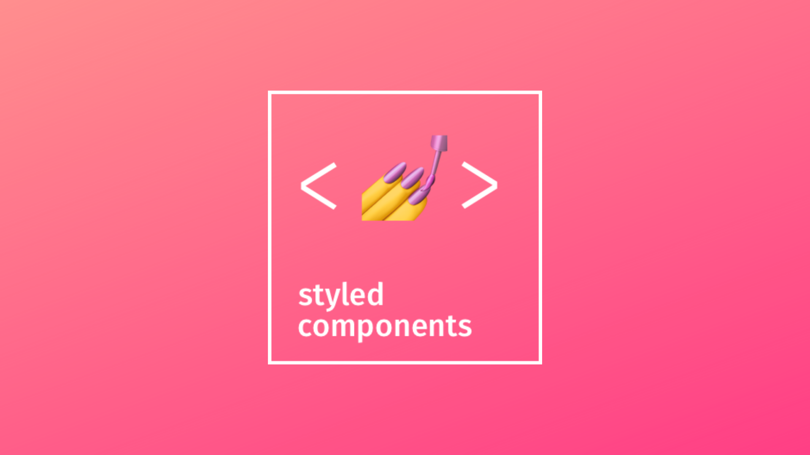

# Styled Component 
<p align="center"></p>

> `styled-components`는 CSS-in-JS 라이브러리로, 이를 통해 자바스크립트로 작성된 파일에 스타일을 정의할 수 있게 해줍니다.

## CSS-in-js?

- CSS-in-js는 CSS의 스타일들을 CSS파일이 아닌 JS에 정의하는 것입니다.

- 개발할 때는 HTML과 CSS, JavaScript는 각자 별도의 파일로 작업을 했습니다.

- 하지만 컴포넌트 기반 개발 방법이 주류가 되면서 재활용성을 고려하게 되었습니다.

- 따라서  컴포넌트에 HTML, CSS, JavaScript을 한번에 적고 사용하는 방식을 채택하게 됩니다.

- 대표적인 라이브러리는 `emotion`과 `styled-component` 방법이 있습니다

## styled-component 사용법

- 먼저 `npm i styled-component`를 사용해 설치하도록 하겠습니다.

- 그리고 아래와 같이 `styled-components`를 불러와서 해당 컴포넌트 안에 div를 불러와 꾸밀수 있습니다.
```js
 
import styled from "styled-components";

styled.div`
  // css정의
`;

import styled from "styled-components";
import InputComponent from "./InputComponent";

styled(InputComponent)`
  // 컴포넌트에 대한 css 정의
`;
```
- 이러한 방식을 통해 조건에 맞추어 색상을 바꾸는 컴포넌트를 만들어 보도록 하겠습니다.

```js
import React from "react";
import styled from "styled-components";

const StyledButton = styled.button`
  font-size: 1rem;
  border: 1px solid black;

  color: ${(props) => props.color || "black"};
  background: ${(props) => props.background || "white"};
`;

function ButtonComponent({ children, color, background }) {
  return (
    <StyledButton color={color} background={background}>
      {children}
    </StyledButton>
  );
}
```

- 사용할떄는 `<Button color="green" background="pink">Green Button</Button>;` 이와 같이 사용할수 있습니다


## global styling

- React와 Styled Components로 개발하면 컴포넌트 레벨에서 스타일을 자주 하게됩니다. 

- 그러다 보면 개별에 컴포넌트에서 동일하게 필요한 내용들이 반복 되게됩니다. 

- 그 예시로는 `css-normalize`나 `css-resetting` 을 할때 걸리게 됩니다.

> 여기서 잠깐 css-normalize, css-resetting 란? 
> 웹에서 보이는 css를 최소한의 오차로 보여주기 위한 기법입니다.
> 우리나라에서는 css-resetting을 이용해 보여주는게 익숙하고 최근 해외에서는 noramilze가 주를 이룹니다.

- 그래서 모든것에 일관적으로 gloabl을 달아주기위해 `createGlobalStyle()`이라는 함수를 통해 해결할수 있습니다.

```js
// Button.jsx

import styled, { css } from "styled-components";

const SIZES = {
  // 생략
};

const VARIANTS = {
  success: css`
    --button-color: #ffffff;
    --button-bg-color: #28a745;
    --button-hover-bg-color: #218838;
  `,
  error: css`
    --button-color: #ffffff;
    --button-bg-color: #dc3545;
    --button-hover-bg-color: #c82333;
  `,
  warning: css`
    --button-color: #212529;
    --button-bg-color: #ffc107;
    --button-hover-bg-color: #e0a800;
  `,
};

function Button({ disabled, size, variant, children }) {
  const sizeStyle = SIZES[size];
  const variantStyle = VARIANTS[variant];

  return (
    <StyledButton
      disabled={disabled}
      sizeStyle={sizeStyle}
      variantStyle={variantStyle}
    >
      {children}
    </StyledButton>
  );
}

const StyledButton = styled.button`
  ${(p) => p.sizeStyle}
  ${(p) => p.variantStyle}

  margin: 0;
  border: none;
  cursor: pointer;
  /* 이하 생략 */
`;

export default Button;
```